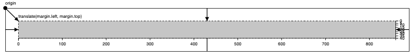
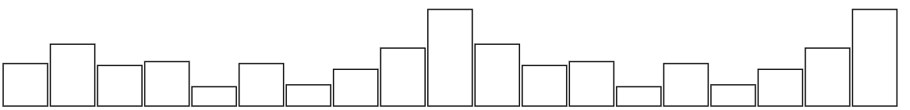
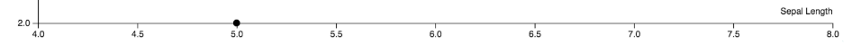
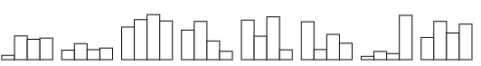
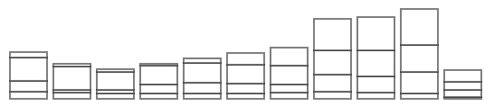
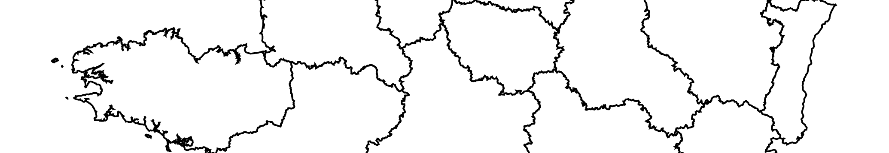
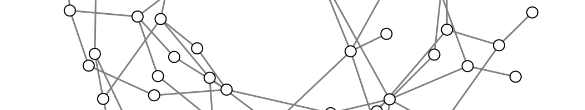

# Interactive Data Visualization (ECL MOS 5.5)

[Romain Vuillemot](http://www.ec-lyon.fr/contacts/romain-vuillemot), *LIRIS, École Centrale de Lyon/Département Math-Info*, [Website](http://romain.vuillemot.net/),  [Twitter](https://twitter.com/romsson).

Contact or questions: romain.vuillemot@ec-lyon.fr

## Reading

<table border="0">
  <tr>
    <td>
      
    </td>
    <td>
      <a href="https://web.archive.org/web/20160307043159/http://chimera.labs.oreilly.com/books/1230000000345">Interactive Data Visualization for the Web</a><br>by Scott Murray
    </td>
  </tr>
</table>

Other books

* [Visualization Analysis and Design](https://www.cs.ubc.ca/~tmm/vadbook/) by Tamara Munzner
* [Design for Information](http://isabelmeirelles.com/book-design-for-information/) by Isabel Meirelles
* [Making Data Visual: A Practical Guide to Using Visualization for Insight](http://shop.oreilly.com/product/0636920041320.do) by Danyel Fisher & Miriah Meyer

## Grading

* 30% Final exam
* 60% Final projects
* 10% Homeworks/Submitted assignments (pass/fail policy)
* 10% Bonus (class participation, best homeworks/assignments)

---
## Submissions

All homeworks/assignements/reports are due the **day before** the class at 23.59pm Lyon Time (GMT+1). Using [this form](https://goo.gl/forms/YAMADA2erDsaNpIA3).

---

## **Lecture 1 - Introduction to Data Visualization** 
*Friday 10/01/2020 13:30-15:30*

* Overview: Class organization ([slides](https://docs.google.com/presentation/d/1YaPshJZLDj6M0XBMtmHqANeH17JINdB3Ie5G8RdC74U/edit#slide=id.p))

* Basics of Data Visualization: Perception, cognition, Visual mapping, Standard charts ([slides](https://docs.google.com/presentation/d/1YY8h1wjfaAv172LVa8kVAnxCyEB547HRL43JlEOvCH0/edit#slide=id.p))

* Authoring visualizations: Libraries, Tools, Tableau Software ([slides](https://docs.google.com/presentation/d/18b-B9wAYpq93nbROxRe9u6-7xexuBLM7T-yapqGoYdo/edit#slide=id.g2f7ee94efd_0_45))

* Introduction to D3.js ([slides](https://docs.google.com/presentation/d/1BtnZZoSmrafigZLbsFqPGwBlhPZHee19SJpUtcHKuCU/edit#slide=id.g2fcdab4196_0_131))

* Final projects description ([slides](https://docs.google.com/presentation/d/1r96OLz_yDkkAsq6segP360Vnr_PJrboO5XEJb0lHgw4/edit?usp=sharing))

## **Tutorial 1 - Tableau Software**
*Friday 10/01/2020 15:45-17:45*

*Tableau Tutorial* 

1. The goal is to have a first experience with Tableau and build standard charts using a simple dataset.
2. Download and install [Tableau Public](https://public.tableau.com/) (Free) on your machine.
3. Altenartive for Linux users is the [Online version of Tableau](https://online.tableau.com/)
4. Other(simple) alternative to Tableau: [Polestar](http://vega.github.io/polestar/)

*Problem 1: Iris flowers visualization*

1. Download the [`iris.csv`](data/iris.csv) and load it in Tableau; convert data types (if needed)
2. Plot a **scatterplot** with X:sepal_length, Y:sepal_width, color:species and a trend line 
3. Save as a tab and save the workbook

*Problem 2: Elections map*

1. Download the [`us-elections-history.csv`](data/us-elections-history.csv) and load it in Tableau; convert data types (if needed)
2. Plot a grid plot with `Year` as columns, `State` as rows and `State Winner` as color/marks.
3. Save as a tab
4. Plot a **geo-map** with colors winning party in 2012 `Latitude (generated)` et `Longitude (generated)`, with `State` as shapes and color `ATTR([State Winner])`
5. Save as a tab and save the workbook
6. Tips: make sure you parse the dataset correctly (FR version of Tableau automatically splits comas)

*Problem 3: Stock markets visualizations*

1. Download the [`stocks.csv`](data/stocks.csv) and load it in Tableau; convert data types (if needed)
2. Plot a **multiple line chart** over time, for all stocks in a different color, grouped by company
3. Plot a **grouped bar chart** (companies as categories, grouped by year or by companies)
4. **Your own chart**!
5. Save as a tab and save the workbook

*Problem 4: Global Superstore Dataset*

1. Download the [`Global-Superstore-Orders-2016.xlsx`](data/Global-Superstore-Orders-2016.xlsx) and load it in Tableau; join datasets (if needed)
2. Find an interesting story / selection with this dataset
3. Create a Dashboard and explain your story/finding
4. BONUS: Add storytelling (Tableau Feature)
5. BONUS: Join other datasets (e.g. People, ..)


📅 **For next class (17/01/2020)**

✍ Assignments

* PROJECT: Group proposal of 2 or 3 students

  * Submit a project topic (1-paragraph): what is the question you expect to answer? which data do you need? how do you plan to collect your data? what are the main risk in collecting/visualizing it? what are the privacy/ethical issues?

  * Create a GitHub account

📖 Readings and preparation

* Read introductions to JavaScript, D3 and Git

* Interactive Data Visualization for the Web [Chapter 1. Introduction
](https://web.archive.org/web/20160307043159/http://chimera.labs.oreilly.com/books/1230000000345/ch01.html), [Chapter 2. Introducing D3](https://web.archive.org/web/20160307043159/http://chimera.labs.oreilly.com/books/1230000000345/ch02.html) and [Chapter 3. Technology Fundamentals](https://web.archive.org/web/20160307043159/http://chimera.labs.oreilly.com/books/1230000000345/ch03.html)

* Get familiar with [JavaScript](https://learnxinyminutes.com/docs/javascript/)

* [Inside look at modern web browser](https://developers.google.com/web/updates/2018/09/inside-browser-part1)

* [Lear how to inspect the DOM tree](https://developers.google.com/web/tools/chrome-devtools/inspect-styles/edit-dom)

* Get familiar with [GitHub](https://try.github.io/levels/1/challenges/1)

## **Tutorial 2 (1/2) - Building visualizations with D3.js** 
*Friday 17/01/2020 13:30-15:30*



* Cheatsheet [intro to D3](https://romsson.github.io/intro-to-d3/)
* [Margin conventions](https://blockbuilder.org/mbostock/3019563)

```
var margin = {top: 20, right: 10, bottom: 20, left: 10};

var width = 960 - margin.left - margin.right,
    height = 500 - margin.top - margin.bottom;
```

***Assignment:** draw a red rectangle (like the gray one above) in the center of the page (using `margin`, `width` and `height`).*

[SOLUTION](https://blockbuilder.org/romsson/b32fddb798bafb7f78427cba22912a8d)

---

**Bar chart** | [SVG](http://blockbuilder.org/romsson/36b1cdc599e8f341a33892f143cf087f)



* Mark: `<rect>`
* Position: `x` and `width`
* Height: `y` and `height`
* Color: `fill` (style)
* Scales: quantitative `d3.scaleLinear()` and categorical `d3.scaleBand()`

***Assignment:** build a bar chart with a random dataset*

* How to generate a random list of integers: `d3.range(n).map(Math.random)`
* The `x.bandwidth()` function generates the` width` attribute for the `<rect>`

[SOLUTION](https://blockbuilder.org/romsson/4e431453beb5c92ff6eb029771b3b8d3)

---

**Line chart** | [SVG](https://blockbuilder.org/romsson/2ff1ee674420b71dc1d3c9731c19ee46)
  


* Mark: `<path>`
* Position: `d3.line().x(function(d) { }).y(function(d) { })` to generate attribute `d`
* Color: style `fill`
* Interpolate: `d3.line().curve(d3.curveCardinal)`
* Scales: `d3.scaleLinear()`

***Assignment:** build a line chart using a simple JSON temporal dataset add circles for each time point.*

* Create a `dataset.json` file in blockbuilder:

`
[{"id" : 1, "name": "A", "value": 10, "date": "2016-01"},
 {"id" : 2, "name": "B", "value": 30, "date": "2016-02"},
 {"id" : 3, "name": "C", "value": 20, "date": "2016-03"}
]
`

* Be careful: one single mark (a line) to draw for the whole dataset!
* Load a JSON dataset: `d3.json("dataset.json", function(error, data) {}`
* Data parsing: `d3.timeParse("%Y-%m")`
* Temporal scale `d3.scaleTime()`
* Data display: `d3.timeFormat("%b %y")`

[SOLUTION](https://blockbuilder.org/romsson/653eaaf6f6b5655af0ebb1e67d3be986)

---

**Scatterplot** | [SVG](https://blockbuilder.org/romsson/7961b125a188ad1167039e4103ff69bf)


* Mark: `<circle>`
* Position: `cx` and `cy`
* Area: `r` (radius) and `d3.scaleSqrt()`
* Color: `fill` (style) and `d3.scaleOrdinal(d3.schemeCategory20)` color scale
 
***Assignment:** build a scatterplot using the Iris dataset and load the chart using a function that takes the chart visual mapping and dimensions as input parameters.*

* [`iris.csv`](data/iris.csv) 
* Load a CSV dataset: `d3.csv('iris.csv', function(error, data){}`

[SOLUTION](https://blockbuilder.org/romsson/f1569bab4188ca15974d90d373f1aad0)

## **Tutorial 2 (2/2) - Building visualizations with D3.js** 
*Friday 17/01/2020 15:45-17:45*

* Advanced D3.js: page layout, d3.nests, legends, scatterplot and grouped bar chart ([slides](https://docs.google.com/presentation/d/14pYKK2dYGnPS6iZ9l1gw1vuiPOGXjjCfeJlArMYRLBs/edit#slide=id.p))

---
**Axis** | SVG

<p align="center">
  
</p>

```
var xAxis = d3.axisBottom()
    .scale(x);

var yAxis = d3.axisLeft()
    .scale(y);

svg.append("g")
      .attr("class", "x axis")
      .attr("transform", "translate(0," + height + ")")
      .call(xAxis)
```
---
**Interaction**

* Mouse click: `.on("click", function(d){})`
* Mouse hover: `.on("mouseover", function(d){})` and `.on("mouseout", function(d) {})`
<!-- https://bl.ocks.org/romsson/f34e556a7d138459c20bad52f1b8293c -->
* Drag & drop `d3.drag`, tooltip ([example](http://bl.ocks.org/romsson/3fe361c8b3ce9e722c1d19f6c55a6d00))

---
**Legends** 

* Display the unique values of an attribute (e.g. use the `color.domain()` to retrieve them) 
* Show the visual mapping for those values (color, shape, etc.) as rows (create a group `<g>` and then fill the rows with the mappings)
* You have to do it yourself!

<!-- Scatterplot IRIS full http://bl.ocks.org/romsson/cd79c68331b0fe423da7d6dac40b4512 -->
---
**Multiple views** 

* Load and coordinate multiple visualizations
* Charts coordination

<!-- https://blockbuilder.org/romsson/7eb8dba335c702707bd2311bd75a28a7 -->
---
***Assignment:** build a coordinated scatterplot matrix using the Iris dataset.*

<!-- https://bl.ocks.org/romsson/3bead896a3379808f88d2181965cf6c0 -->

Submit the blockbuilder link to [submit here](https://docs.google.com/forms/d/e/1FAIpQLSdcv-t-feJ6_BG0I326ymeF7YCK8gltbGvsdMecKCUcwyv77g/viewform) at the end of the class (17h45)

---
📅 **For next class (24/01/2020)**

* CODE: Submit your blockbuilder for scatterplot matrix [✉️ submission form](https://docs.google.com/forms/d/e/1FAIpQLSdcv-t-feJ6_BG0I326ymeF7YCK8gltbGvsdMecKCUcwyv77g/viewform)
* CODE: Extend the line chart using the [`stocks.csv`](data/stocks.csv) where each line is a different symbol (and a different color). BONUS: add a title, legend and interactivity (e.g. tooltip, show time points, etc.) [submission form](https://docs.google.com/forms/d/e/1FAIpQLSdcv-t-feJ6_BG0I326ymeF7YCK8gltbGvsdMecKCUcwyv77g/viewform)

* PROJECT: Write a document that describes the dataset(s) for your project, mechanism to collect the data and expected model (as a table, use Excel). Add more informations:
  * Project full name, project description and members names
  * Data you plan to use, does it exist, if not how you collect it?
  * 3-5 questions you want to answer using your project
  * 5-10 visualizations that are related to your project (screenshot and link sources)
  * **Wait for validation by instructor before any design/coding**

* READINGS: [Chapter 4. Setup](https://web.archive.org/web/20160307043159/http://chimera.labs.oreilly.com/books/1230000000345/ch04.html), [Chapter 5. Data](https://web.archive.org/web/20160307043159/http://chimera.labs.oreilly.com/books/1230000000345/ch05.html), [Chapter 6. Drawing with Data](https://web.archive.org/web/20160307043159/http://chimera.labs.oreilly.com/books/1230000000345/ch06.html), [Chapter 7. Scales](https://web.archive.org/web/20160307043159/http://chimera.labs.oreilly.com/books/1230000000345/ch07.html).

* What is visualization [research](https://medium.com/multiple-views-visualization-research-explained/what-is-visualization-research-what-should-it-be-8840a9ba658)? [literacy](https://medium.com/multiple-views-visualization-research-explained/what-does-visualization-literacy-mean-anyway-22f3b3badc0)?

## **Lecture 3 - Advanced D3.js and Layouts**
*Friday 24/01/2020 13:30-15:30*

* Visualization of [geo](https://docs.google.com/presentation/d/1fY3EHmalb53aZVNYqv2UHjg9_kbtR26saexPTgPKKJs/edit#slide=id.g26ba174e93_0_616) and [temporal data](https://docs.google.com/presentation/d/1HPwRnoc5SvvuhCmxyKnljgqa0oRH6ugDlhM0JQ8qLmM/edit#slide=id.g26b255eefc_0_1105)

* Introduction to [data cleaning tools and methods](https://docs.google.com/presentation/d/1lFAG926PhlkL9Zt-L6pK7zz0EPOlMkhY9prQxE4UbJU/edit#slide=id.g6e08cd9023_0_0)

* Advanced data visualization concepts: Animation, Interaction, Multiple Views ([slides](https://docs.google.com/presentation/d/1g2ZT3LHUnCSmEUIrxow_4APTlnuiMGgID8XxMyt8mz4/edit#slide=id.p))

* Solution for interactive [scatterplot matrix and legend](https://blockbuilder.org/romsson/af97a2bad698ab0c07863015b8ef4622) and multiple line-chart. *How would you improve this chart? by adding [brushing interactions](https://bl.ocks.org/Fil/6d9de24b31cb870fed2e6178a120b17d), including legends in diagonal and [distribution in diagonal](https://www.kylebradbury.org/visualizations/scattermatrix/).* 

* Solution for [stocks line chart](https://blockbuilder.org/romsson/7d94b8925f4c8cb832770921aee23f88). *How would you improve this chart?*

* Advanced D3 layouts ([slides](https://docs.google.com/presentation/d/1a79MLat-ftU25Uk7uM2JYfDSlKS-9hp94EnmegvcLg0/edit#slide=id.p))

## Tutorial 3: More D3.js grouping and layouts
*Friday 24/01/2020 15:45-17:45*

* Grouping data with `d3.nest`

```
{symbol: "MSFT", date: Sat Jan 01 2000 00:00:00 GMT+0100 (CET), price: 39.81}
{symbol: "MSFT", date: Tue Feb 01 2000 00:00:00 GMT+0100 (CET), price: 36.35}
{symbol: "MSFT", date: Wed Mar 01 2000 00:00:00 GMT+0100 (CET), price: 43.22}
```

***Assignment:* Nest stocks by symbol and calculate aggregated values (max/min/sum) over price; parse dates.**

Expected result:

```
0: {key: "MSFT", values: Array(123), maxPrice: 43.22, sumPrice: 3042.6}
1: {key: "AMZN", values: Array(123), maxPrice: 135.91, sumPrice: 5902.4}
2: {key: "IBM", values: Array(123), maxPrice: 130.32, sumPrice: 11225.13}
```
    
* [Tutorial on `d3.nest`](http://bl.ocks.org/phoebebright/raw/3176159/)
* [More examples using `d3.nest`](http://learnjsdata.com/group_data.html)

[SOLUTION](https://bl.ocks.org/romsson/e5c0bdd599a2a51a133e02d3200bcd9c)

---

<!-- MOCKUP https://blockbuilder.org/romsson/e68764eb17e4684aade6c88112299145 -->
**Grouped bar chart** |
  
<p align="center">
  
</p>

* Grouping: `d3.nest`
* Mark: `<rec>`
* Positions: using two categorical scales `d3.scaleBand()` 
* Color: style `fill`

***Assignment:** build a grouped bar chart using the [`stocks.csv`](data/stocks.csv) .*

Start using random data

```
var n = 10, // number of samples
    m = 5; // number of series

var data = d3.range(m).map(function() { 
  return d3.range(n).map(Math.random); 
});
```

[SOLUTION](https://blockbuilder.org/romsson/a78f70f6624184fd33b4dc385a495e75) 

---

**Stacked bar chart** |
  
<p align="center">
  
</p>

* Grouping: [`d3.stack`](https://github.com/d3/d3-shape/blob/master/README.md#stack)
* Mark: `<rec>`
* Positions: nested categorical scales `d3.scaleBand()` 
* Color: style `fill`
* Scales: `d3.scaleLinear()`

***Assignment:** build a stacked bar chart using the [`stocks.csv`](data/stocks.csv) .*

* Start with random data (see grouped bar chart)
* Nest data 
 * by `year` `d.date.getFullYear()`
 * by `symbol`
 * Calculate sum
* Flatten the dataset to be used by the `d3.stack` layout

```
0: {MSFT: 356.07999999999987, AMZN: 527.17, IBM: 1162.97, AAPL: 260.98, year: "2000"}
1: {MSFT: 304.17, AMZN: 140.87, IBM: 1163.6200000000001, AAPL: 122.11000000000003, year: "2001"}
2: {MSFT: 261.92, AMZN: 200.68, IBM: 901.4999999999999, AAPL: 112.89999999999998, year: "2002"}
```

* Apply the `d3.stack()` layout using the list of unique symbols as `keys` and the flat dataset as data


[SOLUTION](https://blockbuilder.org/romsson/8aea86fddcf01380eb96a341509f394f)

---
**Animated transitions**

* Add animation using: `.transition(duration)`, and `.delay(duration)`
* Triggered by a widget, e.g. a `radio` button
* Examples of transitions: [bar chart](https://bl.ocks.org/romsson/3de5bef36f106673278b7ec182c262a6), [D3 show reel](https://bl.ocks.org/mbostock/1256572)).


***Assignment (BONUS):** build an animated transition between grouped bar chart and stacked bar chart.*

* Isolate each layout as two function `grouped` and `stack`
* Add a swap function between each other

```
<div>
  <label><input type="radio" name="mode" value="grouped" checked>Grouped</label>
  <label><input type="radio" name="mode" value="stacked">Stacked</label>
</div>
```

* Bind events using ```d3.selectAll("input").on("change", function() {})```

---

📅 **For next class (31/01/2020)**

1. Write a document for your project data cleaning and preparation: data source, data shaping, processing, etc. If you use external tools (e.g. Excel, DataWrangler, Tableau) add some details of the role and steps performed using those.

2. Load a clean data sample using d3 and descriptive charts (histogram, scatterplot, ..) in a wepage showing the characteristics of the dataset: distribution, statistics, trends, etc. Add this link to your analysis in the class document (the page should be hosted on GitHub).

3. Draw a mockup of your project using pen and paper and add this link to the class document (the page should be hosted on GitHub).

* Read principles of the Five design sheets [methodology](http://fds.design/wp-content/uploads/2015/06/five-design-sheet-approach-JCR.pdf)

* Reading: [Chapter 8. Axes](https://web.archive.org/web/20160307043159/http://chimera.labs.oreilly.com/books/1230000000345/ch08.html), [Chapter 9. Updates, Transitions, and Motion
](https://web.archive.org/web/20160307043159/http://chimera.labs.oreilly.com/books/1230000000345/ch09.html), [Chapter 10. Interactivity](https://web.archive.org/web/20160307043159/http://chimera.labs.oreilly.com/books/1230000000345/ch10.html), [Chapter 11. Layouts](https://web.archive.org/web/20160307043159/http://chimera.labs.oreilly.com/books/1230000000345/ch11.html).


## Lecture 4 - Advanced Layout, Data Cleaning and Case studies
*Friday 31/01/2020 13:30-15:30*

* Introduction to  Sketching, Rapid Prototyping, Development cycles ([slides](https://docs.google.com/presentation/d/11kEkZK12C893qzyEDvkIjgFKPmRKFf-KDDOKiwGw6ys/edit#slide=id.p)) and using the [Five Design Sheet](http://fds.design/) methodology

* Discussion on projects design and case studies ([slides](https://docs.google.com/presentation/d/1RxFTHrEDvGTJiHZ7AmOyX7WQ82o7FEJFs0kosvlD4bg/edit#slide=id.g4e96ed2393_0_54))

## Tutorial 4: Geo-maps and project setup
*Friday 31/01/2020 15:45-17:45*

**Geo-Map** | [Example](https://blockbuilder.org/romsson/a4df41c5b46da7a0635c7cf393df96e3)

<p align="center">
  
</p>

* Mark: `<path>` + `d3.geoPath()`
* Position: `d3.geoPath()`
* Color: `fill` (style)
 
***Assignment:** build a geo-map [following those instructions](https://lyondataviz.github.io/teaching/lyon1-m2/2017/tp4.html).*

<!-- [SOLUTION](https://blockbuilder.org/romsson/969c4ee91b5c436a36053fee592d8b17) -->

* Modern web development tools: local server, package managers ([slides](https://docs.google.com/presentation/d/1Uz3ZjX1f9DJgH73VOrJwi7cgVqwlKIwFPmM4eubUIb8/edit#slide=id.g32bdb64449_0_18))

* Tutorial: page layouts

* [Apply the 5DS](http://fds.design/index.php/resources-and-publications/) to your project (paper and pen!)


---


At the end of the tutorial: 

* Update your proposal after feedback from instructor
* Add the link to (a pdf of all) the design sheets in the class document

📅 **For next class (07/02/2020)**

✍ Assignments

* TBD

## Lecture 5 - Graphs
*Friday 07/02/2020 13:30-15:30*

* Graphs, Networks and Tree visualizations ([slides](https://docs.google.com/presentation/d/1zhbOrcbVMEfnl8tx07TPNuY8oEIeGyuYVeCR5Rb4h9g/edit#slide=id.p))

<!--
* [Interactive geo-map in D3](https://blockbuilder.org/romsson/bfb974bfd600573d763c405d20921b7c)
--> 

## Tutorial 5: Node-Link Graphs
*Friday 07/02/2020 15:45-17:45*


**Node-Link Graph** | [Example](https://blockbuilder.org/romsson/613e64af0ea1fb1567aeac5d29e9ac35)

<p align="center">
  
</p>

* Mark: `<circle>`
* Position: `d3.forceSimulation()`
* Color: `fill` (style)

***Assignment:** starting with this [Node link diagram](https://blockbuilder.org/romsson/613e64af0ea1fb1567aeac5d29e9ac35) that is based on [force layout](img/force.png) with different layouts: [random](img/random.png), [radial](img/radial.png), [line](img/line.png), [line by category](img/line-cat.png) and encodings: [color](img/color.png), [size](img/size.png).* 

* `d3.forceSimulation` [documentation](https://github.com/d3/d3-force) 
* [Parameters playground](https://bl.ocks.org/steveharoz/8c3e2524079a8c440df60c1ab72b5d03))
* [Use multiple foci](http://bl.ocks.org/Kuerzibe/d2e79e28c5591a7e4552b6f9433ebe40) to group nodes by similariy

<!--
[SOLUTION](https://blockbuilder.org/romsson/737693bfe28fb0e8e4d2a4dc55ffd846)
-->

## Projects (1/2)
*Friday 14/02/2020 13:30-15:30*

**Peer-review of other groups projects**

## Projects (2/2)
*Friday 14/02/2020 15:45-17:45*

## Projects: Final projects presentations & demos
*Friday 21/03/2020 13:30-17:45*

Each group has a 15min time slot (10min presentation, 5min questions) to present their project.

**No slide: just show the visualization and tell a convincing story (e.g. don't list features, etc.). Should address the following:**

1. Present context, dataset, data collection
2. Describe key design decisions (visual mappings, interactions, animations, ..)
3. Did the visualization help you find anything of interest in the dataset?
4. Discuss technical challenges, limits, what you would have done with more time.

*There is no report to write for the project, just add a README.md in the repository organized as follows:*

- Name of the participants of the project
- Description of the project
- Screenshots and/or video of the main features
- Credits to external code or data you may have used in your project

**IMPORTANT -- Regarding the dataset**

- If you don't want to share your dataset, add a demo/fake dataset (e.g. sample or fake data) for the live demo
- Provide a way to let users use their own dataset and explain how to do it (upload button? using a Python script? etc.)
- If you take screenshots with the real dataset make sure you preserve individuals privacy

As a general rule keep in mind the projects will be made public so anybody should be able to understand on their own and privacy of the datasets should be preserved.

## Projects: Polish and final submission (autonomie)
*Friday 28/02/2020 13:30-15:30*

## Projects: Polish and final submission (autonomie)
*Friday 28/03/2020 15:45-17:45*

## Exam
*Wednesday 2h written date TBD*

## Online resources

Tableau Software

* [FAQ:  How to learn Tableau](https://community.tableau.com/thread/151389)
* [Build standard charts with Tableau](http://onlinehelp.tableau.com/current/pro/desktop/en-us/dataview_examples.html)

D3.js

* [Gallery of examples](https://github.com/d3/d3/wiki/gallery)
* [Code examples and references for the course "D3.js in Motion"](https://github.com/curran/d3-in-motion)
* [Relearning D3.js](http://www.cagrimmett.com/til/2016/08/07/relearning-d3.html)
* [D3 in depth](http://d3indepth.com/)
* [Awesome D3](https://github.com/wbkd/awesome-d3)
* http://vadim.ogievetsky.com/IntroD3/#1
* https://github.com/arnicas/d3-faq
* [Changes in D3 4.0](https://github.com/d3/d3/blob/master/CHANGES.md)
* [D3 V4 - What's new?](https://iros.github.io/d3-v4-whats-new/#1)
* [Wide vs. Long Data in D3](http://jonathansoma.com/tutorials/d3/wide-vs-long-data/)
* [D3 Cheatsheet](http://www.jeromecukier.net/wp-content/uploads/2012/10/d3-cheat-sheet.pdf)

SVG 

* [SVG Basic Shapes](https://developer.mozilla.org/en-US/docs/Web/SVG/Tutorial/Basic_Shapes)
* [SVG2D3](http://billautomata.github.io/svg2d3/)

Git/GitHub

* Git and GitHub (e.g. [Try GitHub](https://try.github.io/levels/1/challenges/1))
* https://agripongit.vincenttunru.com/
* https://onlywei.github.io/explain-git-with-d3/#freeplay
* https://learngitbranching.js.org/

JavaScript

* [Mozilla Developers Network's Javascript reference](https://developer.mozilla.org/en-US/docs/Web/JavaScript)
* Learn JavaScript (e.g. [JS learnxinyminutes](https://learnxinyminutes.com/docs/javascript/), [learnjsdata](http://learnjsdata.com/index.html))
* JSON (e.g. [JS learnxinyminutes](https://learnxinyminutes.com/docs/json/))
* [Eloquent JavaScript](http://eloquentjavascript.net/Eloquent_JavaScript.pdf)
* [Notes on Douglas Crockford's Javascript the Good Parts 🚀](https://github.com/iteles/Javascript-the-Good-Parts-notes)

Data Visualization Classes

* [DataViz at MIT](http://dataviz.media.mit.edu/)
* [Visual Analytics Ecole Centrale Paris](http://aviz.fr/wiki/pmwiki.php/TeachingVA2017/Schedule) 
* [Dataviz resources](http://www.cs.ubc.ca/group/infovis/resources.shtml)
* https://curran.github.io/dataviz-course-archive/
* https://github.com/Ecohen4/data-viz
* https://github.com/arnicas/interactive-vis-course
* https://docs.google.com/spreadsheets/d/13H77ewqswroMtshWjDZkmcAEvFeRmEjrr-w9E2WHU-E/edit#gid=989980390

Blogs

* http://www.thefunctionalart.com/
* http://eagereyes.org/
* http://visualisingdata.com/

Graphics/Journals

* http://www.bloomberg.com/visual-data/
* http://data.huffingtonpost.com/

Color

* [D3 color schemes](https://beta.observablehq.com/@mbostock/d3-color-schemes)
* https://cloudflare.design/color/
* [ColorBrewer](http://colorbrewer2.org/)
* https://ciechanow.ski/color-spaces/
* [Nomenclature of colours](https://www.c82.net/werner/)

Misc

* [Command line tutorial](https://www.learnenough.com/command-line-tutorial)
* https://egghead.io/lessons/debugging-with-dev-tools
* Design essay: [Picturing the Great Migration](https://medium.com/info-we-trust/picturing-the-great-migration-9e4b5a3eca8a)
* [What to Expect in the Data Visualization Engineer Job Interviews
](https://medium.com/@kristw/what-to-expect-in-data-visualization-engineer-job-interviews-54053b896a75)
* [State of JavaScript 2019](https://2019.stateofjs.com/)
