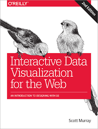

# Interactive Data Visualization (ECL MOS 5.5)

[Romain Vuillemot](http://www.ec-lyon.fr/contacts/romain-vuillemot), *LIRIS, École Centrale de Lyon/Département Math-Info*, [Website](http://romain.vuillemot.net/),  [Twitter](https://twitter.com/romsson).

Contact or questions: romain.vuillemot@ec-lyon.fr

## Reading

<table border="0">
  <tr>
    <td>
      
    </td>
    <td>
      <a href="https://web.archive.org/web/20160307043159/http://chimera.labs.oreilly.com/books/1230000000345">Interactive Data Visualization for the Web</a> by Scott Murray
    </td>
  </tr>
</table>

Other books

* [Visualization Analysis and Design](https://www.cs.ubc.ca/~tmm/vadbook/) by Tamara Munzner
* [Design for Information](http://isabelmeirelles.com/book-design-for-information/) by Isabel Meirelles
* [Making Data Visual: A Practical Guide to Using Visualization for Insight](http://shop.oreilly.com/product/0636920041320.do) by Danyel Fisher & Miriah Meyer

## Grading

* 30% Final exam
* 60% Final projects
* 10% Homeworks/Submitted assignments (pass/fail policy)
* 10% Bonus (class participation, best homeworks/assignments)

---
## Submissions

All homeworks/assignements/reports are due the **day before** the class at 23.59pm Lyon Time (GMT+1). Using [this form](https://goo.gl/forms/YAMADA2erDsaNpIA3).

---

## **Lecture 1 - Introduction to Data Visualization** 
*Friday 11/01/2019 13:30-15:30*

* Overview: Class organization ([slides](https://docs.google.com/presentation/d/1YaPshJZLDj6M0XBMtmHqANeH17JINdB3Ie5G8RdC74U/edit#slide=id.p))
* Basics of Data Visualization: Perception, cognition, Visual mapping, Standard charts ([slides](https://docs.google.com/presentation/d/1YY8h1wjfaAv172LVa8kVAnxCyEB547HRL43JlEOvCH0/edit#slide=id.p))
* Authoring visualizations: Libraries, Tools, Tableau Software ([slides](https://docs.google.com/presentation/d/18b-B9wAYpq93nbROxRe9u6-7xexuBLM7T-yapqGoYdo/edit#slide=id.g2f7ee94efd_0_45))

## **Tutorial 1 - Tableau Software**
*Friday 11/01/2019 15:45-17:45*

*Tableau Tutorial* 

1. The goal is to have a first experience with Tableau and build standard charts using a simple dataset.
2. Download and install [Tableau Public](https://public.tableau.com/) (Free) on your machine
3. (Simple) alternative to Tableau: [Polestar](http://vega.github.io/polestar/)

*Iris flowers visualization*

1. Download the [`iris.csv`](data/iris.csv) and load it in Tableau; convert data types (if needed)
2. Plot a **scatterplot** with X:sepal_length, Y:sepal_width, color:species and a trend line 
3. Save as a tab and save the workbook

*Elections map*

1. Download the [`us-elections-history.csv`](data/us-elections-history.csv) and load it in Tableau; convert data types (if needed)
2. Plot a grid plot with `Year` as columns, `State` as rows and `State Winner` as color/marks.
3. Save as a tab
4. Plot a **geo-map** with colors winning party in 2012 `Latitude (generated)` et `Longitude (generated)`, with `State` as shapes and color `ATTR([State Winner])`
5. Save as a tab and save the workbook

*Stock markets visualizations*

1. Download the [`stocks.csv`](data/stocks.csv) and load it in Tableau; convert data types (if needed)
2. Plot a **multiple line chart** over time, for all stocks in a different color, grouped by company
3. Plot a **grouped bar chart** (companies as categories, grouped by year or by companies)
4. **Your own chart**!
5. Save as a tab and save the workbook

*Global Superstore Dataset*

1. Download the [`Global-Superstore-Orders-2016.xlsx`](data/Global-Superstore-Orders-2016.xlsx) and load it in Tableau; join datasets (if needed)
2. Find an interesting story / selection with this dataset
3. Create a Dashboard and explain your story/finding
4. BONUS: Add storytelling (Tableau Feature)
5. BONUS: Join other datasets (e.g. People, ..)

📅 **For next class (20/01)**

✍ Assignments

* Submit your Tableau workbook on Global Superstore dataset
* Propose a project topic (2-page): what is the question you want to answer? which data do you need? how do you plan to collect your data? what are the main risk in collecting/visualizing it? what are the privacy/ethical issues?
* Create a GitHub account and learn how to use it (bottom of the page)

📖 Readings

* Interactive Data Visualization for the Web [Chapter 1. Introduction
](https://web.archive.org/web/20160307043159/http://chimera.labs.oreilly.com/books/1230000000345/ch01.html), [Chapter 2. Introducing D3](https://web.archive.org/web/20160307043159/http://chimera.labs.oreilly.com/books/1230000000345/ch02.html) and [Chapter 3. Technology Fundamentals](https://web.archive.org/web/20160307043159/http://chimera.labs.oreilly.com/books/1230000000345/ch03.html)

* Get familiar with [JavaScript](https://learnxinyminutes.com/docs/javascript/)

* [Inside look at modern web browser](https://developers.google.com/web/updates/2018/09/inside-browser-part1)

* [Lear how to inspect the DOM tree](https://developers.google.com/web/tools/chrome-devtools/inspect-styles/edit-dom)

## **Lecture 2 - Introduction to D3.js** 
*Friday 18/01/2019 13:30-15:30*

* Solution from previous homework ([example](https://data.world/tableauhelp/superstore-data-sets))
* Feedback on projects topics ([slides](https://docs.google.com/presentation/d/1r96OLz_yDkkAsq6segP360Vnr_PJrboO5XEJb0lHgw4/edit?usp=sharing))
* Standard chart + Time/Geo charts ([slides](https://docs.google.com/presentation/d/1YY8h1wjfaAv172LVa8kVAnxCyEB547HRL43JlEOvCH0/edit#slide=id.g2ed13e6d0c_0_5))
* Advanced data visualization concepts: Animation, Interaction, Multiple Views ([slides](https://docs.google.com/presentation/d/1g2ZT3LHUnCSmEUIrxow_4APTlnuiMGgID8XxMyt8mz4/edit#slide=id.p))
* D3.js: Principles, Codes, Web Development ([slides](https://docs.google.com/presentation/d/1BtnZZoSmrafigZLbsFqPGwBlhPZHee19SJpUtcHKuCU/edit#slide=id.p))
 
## **Tutorial 2: D3.js** 
*Friday 18/01/2019 15:45-17:45*

* [Intro to D3](https://romsson.github.io/intro-to-d3/)
* Let's build a [bar chart using SVG only](http://blockbuilder.org/romsson/36b1cdc599e8f341a33892f143cf087f) (without D3)
* Let's build a [bar chart with D3 *without* data binding](http://blockbuilder.org/romsson/f865e7c5c05c805759486a3cf435a548)
* Let's build a [bar chart with D3 *using* data binding](http://blockbuilder.org/romsson/e7aeedeb03300f4cdfd54531e33e9b68)
* Let's build an interactive bar chart
* Let's build an interactive bar chart using a dataset
* Let's build an [interactive line chart using a dataset](http://bl.ocks.org/romsson/4fab85668c5cbed4fe0c070fa56d7a77)
* [Result from class](https://blockbuilder.org/romsson/1a0c14ecfd3f4a8eae6b7dc0140a5ada)

📅 **For next class (25/01)**

* Extend the line chart using the [`stocks.csv`](data/stocks.csv) where each line is a different symbol (and a different color)
* BONUS: add a vertical axis
* BONUS: rank chart and a [toggle button](https://romsson.github.io/rankings/ranking.html)

* Reading: [Chapter 4. Setup](https://web.archive.org/web/20160307043159/http://chimera.labs.oreilly.com/books/1230000000345/ch04.html), [Chapter 5. Data](https://web.archive.org/web/20160307043159/http://chimera.labs.oreilly.com/books/1230000000345/ch05.html), [Chapter 6. Drawing with Data](https://web.archive.org/web/20160307043159/http://chimera.labs.oreilly.com/books/1230000000345/ch06.html), [Chapter 7. Scales](https://web.archive.org/web/20160307043159/http://chimera.labs.oreilly.com/books/1230000000345/ch07.html).
* Each project describe the expected dataset, mechanism to collect the data and expected model (as a table, use Excel)
  * Project full name, project description and members names
  * Data you plan to use, does it exist, if not how you collect it?
  * 3-5 questions you want to answer using your project
  * **Wait for validation by instructor before any coding**

* What is visualization [research](https://medium.com/multiple-views-visualization-research-explained/what-is-visualization-research-what-should-it-be-8840a9ba658)? [literacy](https://medium.com/multiple-views-visualization-research-explained/what-does-visualization-literacy-mean-anyway-22f3b3badc0)?

## **Lecture 3 - Advanced D3.js and Design Methods**
*Friday 25/01/2019 13:30-15:30*

* [Solution stock line chart](https://blockbuilder.org/romsson/7d94b8925f4c8cb832770921aee23f88) (another one using [d3.nest](https://blockbuilder.org/romsson/57eb273e01761b829aaa95b28c8193c1))

* Advanced D3.js: page layout, d3.nests, legends, scatterplot and grouped bar chart ([slides](https://docs.google.com/presentation/d/14pYKK2dYGnPS6iZ9l1gw1vuiPOGXjjCfeJlArMYRLBs/edit#slide=id.p))

Class example: [multiple scatterplot](https://blockbuilder.org/romsson/7eb8dba335c702707bd2311bd75a28a7)

## Tutorial 3: Design Methods & more D3.js 
*Friday 25/01/2019 15:45-17:45*

* Sketching, Rapid Prototyping, Development cycles ([slides](https://docs.google.com/presentation/d/11kEkZK12C893qzyEDvkIjgFKPmRKFf-KDDOKiwGw6ys/edit#slide=id.p)) and using the [Five Design Sheet](http://fds.design/) methodology

* Read principles of the Five design sheets [methodology](http://fds.design/wp-content/uploads/2015/06/five-design-sheet-approach-JCR.pdf)

* [Apply it](http://fds.design/index.php/resources-and-publications/) to your project (paper and pen!)

At the end of the tutorial: 

* Update your proposal after feedback from instructor
* Add the link to (a pdf of all) the design sheets in the class document

📅 **For next class (02/02)**

1. [Grouped bar chart](https://blockbuilder.org/romsson/a78f70f6624184fd33b4dc385a495e75) chart using the [`stocks.csv`](data/stocks.csv) dataset and [`d3.nest`](http://learnjsdata.com/group_data.html)

* BONUS: [Stacked bar chart](https://blockbuilder.org/romsson/8aea86fddcf01380eb96a341509f394f)
* BONUS: Transition between stacked and grouped (see [D3 show reel](https://bl.ocks.org/mbostock/1256572))

2. Data analysis of your project dataset (or expected dataset) using D3 or Tablea: load data from an external file (CSV, JSON), create a first chart characterising the **distribution** of the dataset (e.g. time series, bar chart, ), scatterplot. Add the link to your analysis in the class document.

3. Update your design sheets and update link in the class document.

* Reading: [Chapter 8. Axes](https://web.archive.org/web/20160307043159/http://chimera.labs.oreilly.com/books/1230000000345/ch08.html), [Chapter 9. Updates, Transitions, and Motion
](https://web.archive.org/web/20160307043159/http://chimera.labs.oreilly.com/books/1230000000345/ch09.html), [Chapter 10. Interactivity](https://web.archive.org/web/20160307043159/http://chimera.labs.oreilly.com/books/1230000000345/ch10.html), [Chapter 11. Layouts](https://web.archive.org/web/20160307043159/http://chimera.labs.oreilly.com/books/1230000000345/ch11.html).

## Lecture 4 - Advanced Layout, Data Cleaning and Case studies
*Friday 01/02/2019 13:30-15:30*

* Solution [stock grouped bar chart](https://blockbuilder.org/romsson/64adf11897d67c21f4a0e0e16616df39) and [stacked bar chart](https://blockbuilder.org/romsson/8aea86fddcf01380eb96a341509f394f)) see [slides](https://docs.google.com/presentation/d/14pYKK2dYGnPS6iZ9l1gw1vuiPOGXjjCfeJlArMYRLBs/edit#slide=id.g327e636b06_0_422)

* Advanced layouts ([slides](https://docs.google.com/presentation/d/1a79MLat-ftU25Uk7uM2JYfDSlKS-9hp94EnmegvcLg0/edit#slide=id.p))

* Case studies ([slides](https://docs.google.com/presentation/d/1RxFTHrEDvGTJiHZ7AmOyX7WQ82o7FEJFs0kosvlD4bg/edit#slide=id.g4e96ed2393_0_54))

## Tutorial 4: Geo-maps and project setup
*Friday 01/02/2019 15:45-17:45*

* Feedback on projects
* Introduction to [data cleaning tools and methods](http://romain.vuillemot.net/publis/slides-daquata-workshop-data-cleaning-dataviz.pdf)
* Modern web development tools: local server, package managers ([slides](https://docs.google.com/presentation/d/1Uz3ZjX1f9DJgH73VOrJwi7cgVqwlKIwFPmM4eubUIb8/edit#slide=id.g32bdb64449_0_18))
* Tutorial: [build a geo-map](https://lyondataviz.github.io/teaching/lyon1-m2/2017/tp4.html)

📅 **For next class (08/02)**

✍ Assignments

* Add slider and tooltips to the geo-map
* Final design of projects
* Link to online demo (e.g. Github page) with blank document or first visualization

## Lecture 5 - Graphs
*Friday 08/02/2019 13:30-15:30*

* Graphs, Networks and Tree visualizations ([slides](https://docs.google.com/presentation/d/1zhbOrcbVMEfnl8tx07TPNuY8oEIeGyuYVeCR5Rb4h9g/edit#slide=id.p))

* [Solution interactive geo-map](https://blockbuilder.org/romsson/bfb974bfd600573d763c405d20921b7c)

## Tutorial 5: Node-Link Graphs
*Friday 08/02/2019 15:45-17:45*

* Load this [Node link diagram](https://blockbuilder.org/romsson/613e64af0ea1fb1567aeac5d29e9ac35) based on [force layout](img/force.png) (see [documentation](https://github.com/d3/d3-force) and [parameters playground](https://bl.ocks.org/steveharoz/8c3e2524079a8c440df60c1ab72b5d03)) 

Update it with more features:

1. Layouts: [random](img/random.png), [radial](img/radial.png), [line]](img/line.png), [line by category](img/line-cat.png).
2. Encodings: [color](img/color.png), [size](img/size.png).

BONUS: [multiple foci](http://bl.ocks.org/Kuerzibe/d2e79e28c5591a7e4552b6f9433ebe40)

[Solution](https://blockbuilder.org/romsson/737693bfe28fb0e8e4d2a4dc55ffd846)

## Projects (1/2)
*Friday 15/02/2019 13:30-15:30*

**Peer-review of other groups projects** Fill [this form](https://goo.gl/forms/zjNnExy0NC9zAct53):

## Projects (2/2)
*Friday 15/02/2019 15:45-17:45*

## Projects (autonomie)
*Friday 01/03/2019 13:30-15:30*

## Projects (autonomie)
*Friday 01/03/2019 15:45-17:45*

## Projects: Final projects presentations & demos
*Friday 08/03/2019 13:30-17:45*

Each group has a 15min time slot (10min presentation, 5min questions) to present their project.

**No slide: just show the visualization and tell a convincing story (e.g. don't list features, etc.). Should address the following:**

1. Present context, dataset, data collection
2. Describe key design decisions (visual mappings, interactions, animations, ..)
3. Did the visualization help you find anything of interest in the dataset?
4. Discuss technical challenges, limits, what you would have done with more time.

*There is no report to write for the project, just add a README.md in the repository organized as follows:*

- Name of the participants of the project
- Description of the project
- Screenshots and/or video of the main features
- Credits to external code or data you may have used in your project

**IMPORTANT -- Regarding the dataset**

- If you don't want to share your dataset, add a demo/fake dataset (e.g. sample or fake data) for the live demo
- Provide a way to let users use their own dataset and explain how to do it (upload button? using a Python script? etc.)
- If you take screenshots with the real dataset make sure you preserve individuals privacy

As a general rule keep in mind the projects will be made public so anybody should be able to understand on their own and privacy of the datasets should be preserved.

## Exam
*Wednesday 13/03/2019 16:30-18:30*

## Online resources

Tableau

* [FAQ:  How to learn Tableau](https://community.tableau.com/thread/151389)
* [Build standard charts with Tableau](http://onlinehelp.tableau.com/current/pro/desktop/en-us/dataview_examples.html)

D3.js

* [Gallery of examples](https://github.com/d3/d3/wiki/gallery)
* [Code examples and references for the course "D3.js in Motion"](https://github.com/curran/d3-in-motion)
* [Relearning D3.js](http://www.cagrimmett.com/til/2016/08/07/relearning-d3.html)
* [D3 in depth](http://d3indepth.com/)
* [Awesome D3](https://github.com/wbkd/awesome-d3)
* http://vadim.ogievetsky.com/IntroD3/#1
* https://github.com/arnicas/d3-faq
* [Changes in D3 4.0](https://github.com/d3/d3/blob/master/CHANGES.md)
* [D3 V4 - What's new?](https://iros.github.io/d3-v4-whats-new/#1)
* [Wide vs. Long Data in D3](http://jonathansoma.com/tutorials/d3/wide-vs-long-data/)
* [D3 Cheatsheet](http://www.jeromecukier.net/wp-content/uploads/2012/10/d3-cheat-sheet.pdf)

SVG 

* [SVG2D3](http://billautomata.github.io/svg2d3/)

Git/GitHub

* Git and GitHub (e.g. [Try GitHub](https://try.github.io/levels/1/challenges/1))
* https://agripongit.vincenttunru.com/
* https://onlywei.github.io/explain-git-with-d3/#freeplay
* https://learngitbranching.js.org/

JavaScript

* [Mozilla Developers Network's Javascript reference](https://developer.mozilla.org/en-US/docs/Web/JavaScript)
* Learn JavaScript (e.g. [JS learnxinyminutes](https://learnxinyminutes.com/docs/javascript/), [learnjsdata](http://learnjsdata.com/index.html))
* JSON (e.g. [JS learnxinyminutes](https://learnxinyminutes.com/docs/json/))
* [Eloquent JavaScript](http://eloquentjavascript.net/Eloquent_JavaScript.pdf)
* (Notes on Douglas Crockford's Javascript the Good Parts 🚀
)[https://github.com/iteles/Javascript-the-Good-Parts-notes]

Data Visualization Classes

* http://dataviz.media.mit.edu/
* [Visual Analytics Ecole Centrale Paris](http://aviz.fr/wiki/pmwiki.php/TeachingVA2017/Schedule) 
* Dataviz resources http://www.cs.ubc.ca/group/infovis/resources.shtml
* https://curran.github.io/dataviz-course-archive/
* https://github.com/Ecohen4/data-viz
* https://github.com/arnicas/interactive-vis-course
* https://docs.google.com/spreadsheets/d/13H77ewqswroMtshWjDZkmcAEvFeRmEjrr-w9E2WHU-E/edit#gid=989980390

Blogs

* http://www.thefunctionalart.com/
* http://eagereyes.org/
* http://visualisingdata.com/

Graphics/Journals

* http://www.bloomberg.com/visual-data/
* http://data.huffingtonpost.com/

Color

* [D3 color schemes](https://beta.observablehq.com/@mbostock/d3-color-schemes)
* https://cloudflare.design/color/
* [ColorBrewer](http://colorbrewer2.org/)

Misc

* [Command line tutorial](https://www.learnenough.com/command-line-tutorial)
* https://egghead.io/lessons/debugging-with-dev-tools
* Design essay: [Picturing the Great Migration](https://medium.com/info-we-trust/picturing-the-great-migration-9e4b5a3eca8a)

